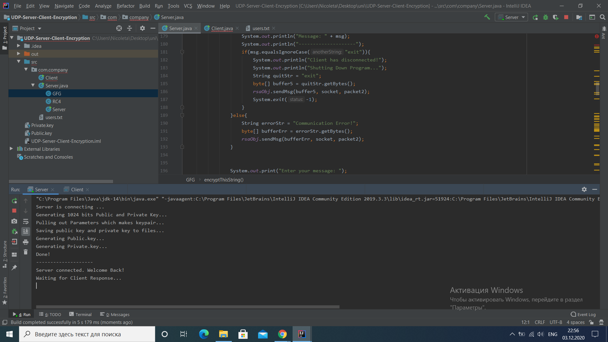
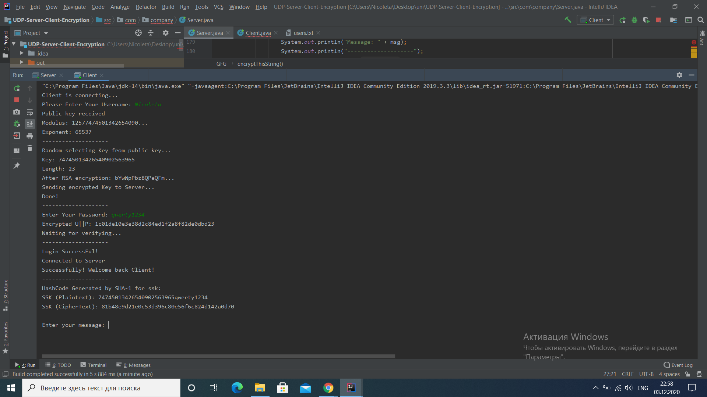
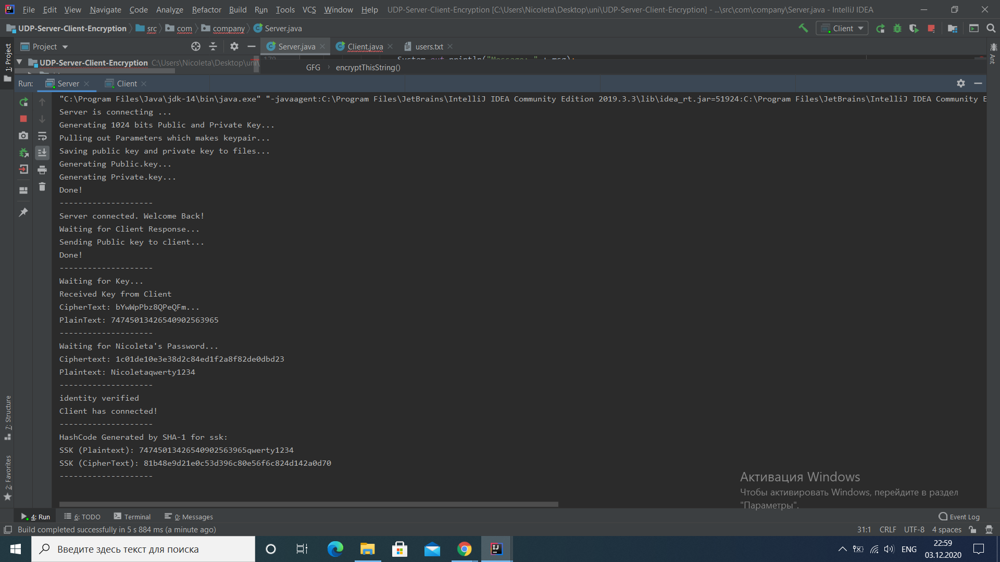
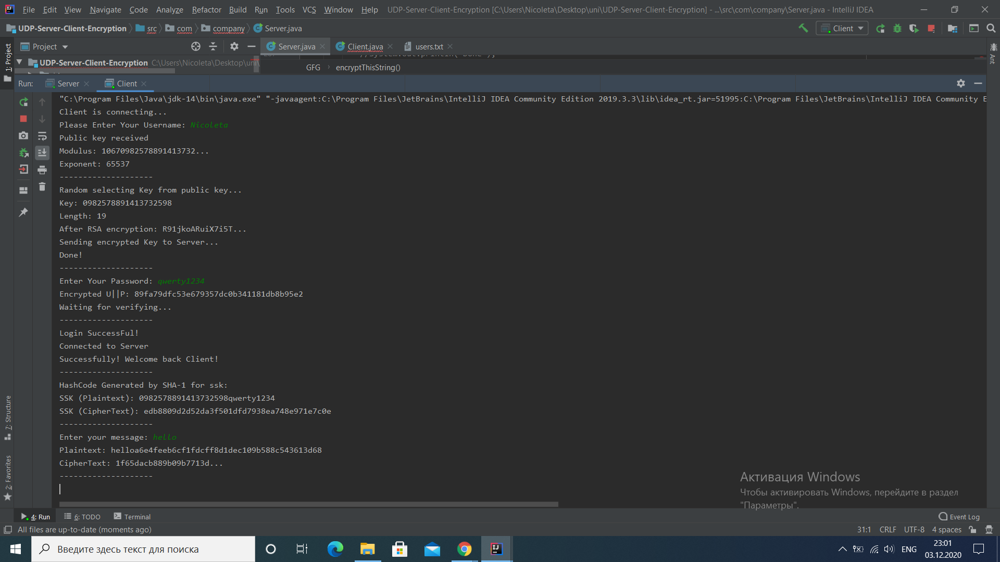
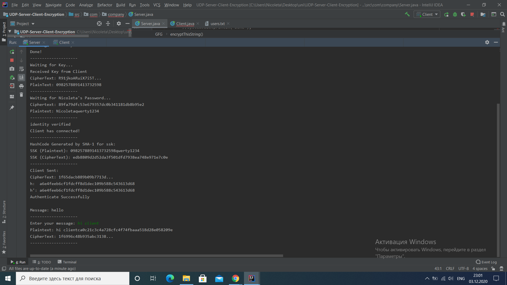
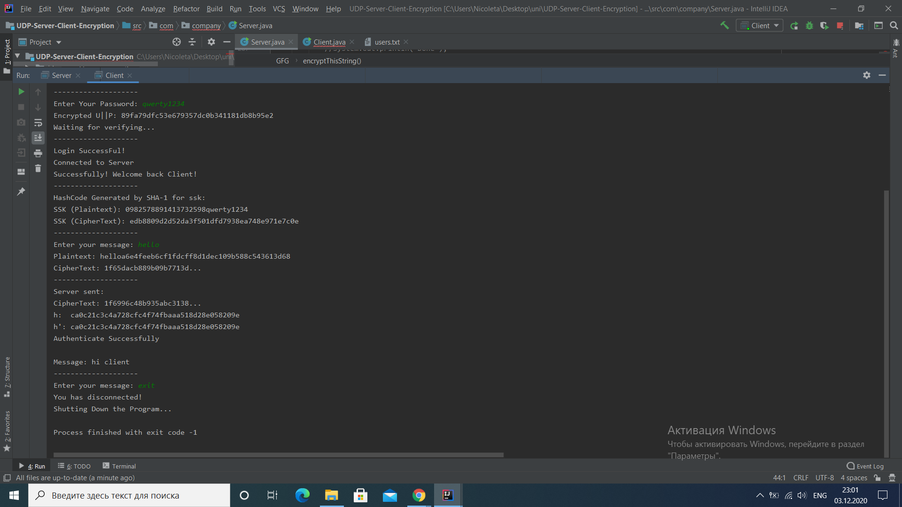

# Network Programming laboratory work nr. 2
## Task:
 * Implement a protocol atop UDP, with error checking and retransmissions. Limit the number of retries for retransmissions.
 * Make the connection secure, using either a CA to get the public key of the receiver and encrypt data with it, or using Diffie-Hellman to get a shared connection key between the client and server, ensure that the traffic is encrypted.
 * Regarding the application-level protocol, you have 3 options:
   - make an FTP-like protocol for data transfer, thus you will need to ensure data splitting and in-order delivery and reassembly at the destination. The protocol must support URIs, file creation and update (PUT), file fetching (GET) and metadata retrieval (OPTIONS)
   - make a protocol based on the workings (state machine) of an ATM
   - make a protocol based on the workings (state machine) of a stationary telephone

 For this laboratory work I implemented a UDP protocol in Java using Datagram Sockets.
 For this purpose I created 2 classes, one for UDP Server ```Server.java``` and another one for UDP Client ```Client.java```. I have implemented encryption also, but didn't manage to do application protocol.
 
Here are some screen shots of the output:
* Server:

* Client

* Server

* Client

* Server

* Client
